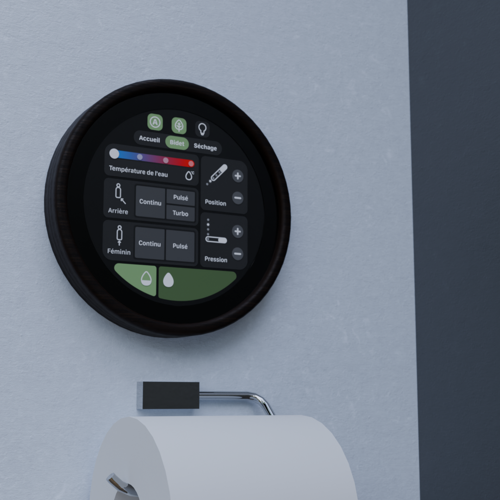

# vovoTouch

An intuitive touchscreen HMI for VOVO bidet toilets
## Features
### User profiles
Customizable user profiles provide easy access to a user's preferred temperature, position, and pressure configurations.
### Ease of operation
Compared to the original remote's dense button grid, vovoTouch's intuitive UI displays operations in a logical manner, without clutter from maintenance functions, which are hidden in a service mode.

## Roadmap
- [x] Figma UI Design
- [x] Basic UI
- [x] Original remote reverse engineering
- [x] Successful infrared code replay through the touchscreen's hardware
- [x] General touch button function assignment
- [x] Language localization
- [ ] (IN PROGRESS) User profiles
- [ ] Architecture refactoring : Styling should be done in a theme to prevent bloating component classes unnecessarily
- [ ] OTA updates
- [ ] Weather report
- [ ] User theme colors

 ## Hardware
 vovoTouch is developed with ESP32-P4 as its hardware target, more specifically [Waveshare's 4" ESP32-P4-based round touch LCD](https://www.waveshare.com/esp32-p4-wifi6-touch-lcd-3.4c.htm?sku=31522).

 ## Hardware connections
 *TBD*
